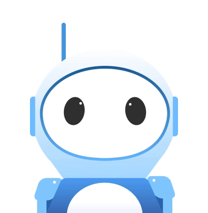

# Распознаём речь


### Описание проекта
Доступно 2 бота: телеграмм бот и vk бот. 
Все они работают по одному принципу и подключены к [DialogFlow](https://dialogflow.cloud.google.com/#/getStarted), что позволяет им распознавать текст.\
Их задачи заключаются в том, чтобы отвечать пользователю, как устроиться на работу.
Отличие только в том, что vk бот не отвечает на непонятные ему сообщения, так как за ним следят операторы техподдержки.\
Пример результата для Telegram: \
 \
Пример результата для ВКонтакте: \


### Как запустить
Для запуска на своем компьютере вам потребуется:

1. Свежая версия [Python](https://www.python.org).
2. Сохранить библиотеку на свой компьютер:
```
git clone https://github.com/inkvizitor1991/bot-recognize-speech.git
``` 
3. Установить зависимости:
```
pip install -r requirements.txt
``` 
4. Добавить фразы для ботов (перед этим заполните `phrase.json` своими данными):
```
python training_phrase.py
```
5. Запустить телеграмм бот:
```
python tg_bot.py
``` 
6. Запустить vk бот:
```
python tg_bot.py
```
### Аргументы
Вы можете указать свой путь до JSON-файла с фразами: 
- --json_path — указать свой путь к *.json файлу с данными.

$ python phrase.py --json_path phrase.json

### Переменные окружения

Часть настроек проекта берётся из переменных окружения. Чтобы их определить, создайте файл `.env` в корне проекта и запишите туда данные в таком формате: `ПЕРЕМЕННАЯ=значение`.

Доступны следующие переменные:
- `TG_BOT_TOKEN` — токен телеграм бота. Создать бота и получить токен можно у [BotFather](https://telegram.me/BotFather), для этого необходимо ввести `/start` и следовать инструкции.
- `GOOGLE_APPLICATION_CREDENTIALS` — путь до файла с ключами. [Создание JSON-ключа](https://cloud.google.com/docs/authentication/getting-started). 
- `DIALOG_FLOW_PROJECT_ID` — `id` проекта `на DialogFlow`. Получить `id` проекта на [DialogFlow](https://cloud.google.com/dialogflow/es/docs/quick/setup).
- `VK_GROUP_TOKEN` — создайте группу [в контакте](https://vk.com/groups) и в разделе: `Работа с API`, получите токен.
